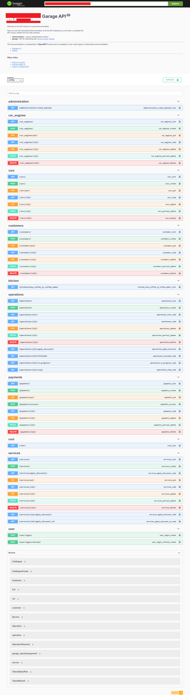
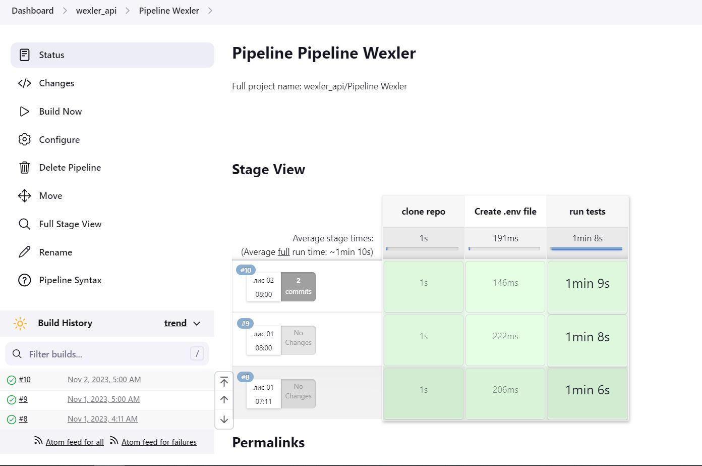

# Automation project according to the Api documentation in swagger in Python and the **request** library. 

## Test structure

* Smoke tests: `tests/smoke`
* Regression tests: `tests/regress`

## CI runs (GitHub Actions)

* Daily smoke run (scheduled) + manual run: `.github/workflows/smoke.yml`
* Regression run on `push`/`pull_request` + manual run: `.github/workflows/regression.yml`

## Негативні тести (коротко)
Покриваємо перевірки на:
* відсутні або порожні обовʼязкові поля;
* неправильні типи даних і формат значень;
* невалідні/несумісні значення (діапазони, дати, маски);
* неіснуючі або некоректні `id` (404/400);
* неавторизований доступ і невалідні токени (401/403);
* дублікати/конфлікти при створенні (409).

## Ретраї та запуск у потоках
* Ретраї: `pytest-rerunfailures` (за замовчуванням `--reruns=2 --reruns-delay=10`).
* Паралельний запуск: `pytest-xdist` (за замовчуванням `-n=3`).
* Перевизначення локально:
  * `pytest -n auto --reruns 0`
  * `pytest tests/smoke -n 2 --reruns 1 --reruns-delay 5`

## Allure звіти
* Результати тестів пишуться у `allure-results`.
* У CI звіт генерується Allure Report 3.

## The following functionality is covered by autotests:

### API tests

* Administration 
    * ✅ Administration

* Car Engines
  * ✅ List car engines 
  * ✅ Create car engines post 
  * ✅ Create car engines put 
  * ✅ Details by random engine number 
  * ✅ Update car engines 
  * ✅ Partial update car engines 
  * ✅ Delete car engines 
  
* Cars
  * ✅ List cars 
  * ✅ Create cars post 
  * ✅ Create cars put 
  * ✅ Details by random car 
  * ✅ Update cars 
  * ✅ Partial update cars 
  * ✅ Delete cars
  
* Customers
  * ✅ List customers 
  * ✅ Create customers post 
  * ✅ Create customers put 
  * ✅ Details by random customer 
  * ✅ Update customer 
  * ✅ Partial update customer 
  * ✅ Delete customer 
  
* Kitchen
  * ✅ Brew coffee in coffee maker list 

* Operations
  * ✅ Operations list 
  * ✅ Create operations 
  * ✅ Init operations 
  * ✅ Details by random operations 
  * ✅ Update operations 
  * ✅ Partial update operations 
  * ✅ Delete operations 
  * ✅ Finished operations 
  * ✅ Operations in progress 
  * ✅ Stop operations 

* Payments
  * ✅ Payments list 
  * ✅ Create payments post 
  * ✅ Create payments put 
  * ✅ Payments success 
  * ✅ Read payments 
  * ✅ Update payments 
  * ✅ Partial update payments 
  * ✅ Delete payments 

* Root
  * ✅ Root list

* Services
  * ✅ Services list 
  * ✅ Create services post 
  * ✅ Apply discounts v2 services 
  * ✅ Create services put 
  * ✅ Details by random service id 
  * ✅ Update services 
  * ✅ Partial update services 
  * ✅ Delete services 
  * ✅ Apply discounts services 
  * ✅ Apply discounts for all services 

* User
  * ✅ User login 
  * ✅ Login refreh 


<br>


## The project was implemented using

<p  align="center">
  <code></code>
  <code></code>
  <code></code>
  <code></code>
  <code></code>
  <code></code>
  <code></code>
</p>
<br>

<br>

#  Documentation for APIs and endpoints

<p align="center">

</p>
<br>


#  Autotests are run on the Jenkins server

<p align="center">

</p>
<br>


## Running tests

Local Launch:
```
pytest .
```
Smoke only:
```
pytest tests/smoke
```
Regression only:
```
pytest tests/regress
```
Remote launch:
```
python3 -m venv .venv
. .venv/bin/activate
pip install poetry
poetry install
poetry run pytest
```
<br>


