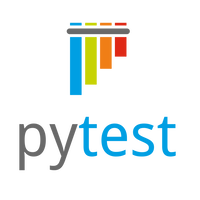

# Diploma project on test automation in Python + Selene. 


* UI - https://yedalms.io/
* API - https://yedalms.io/
* Mobile - https://www.booking.com/

## The following functionality is covered
* UI (college admin panel tests)- https://yedalms.io/
    * ✅ Creating an article
    * ✅ Creating a bundle
    * ✅ Creating a course
    * ✅ Creating lessons
    * ✅ Creating a questionnaire(s) 
    * ✅ Creating a feedback form(survey)
    * ✅ Creating a student
    * ✅ Creating a lecturer
    * ✅ Filling the questionnaire with content
    * ✅ Filling the bundle with content

<br>
  
* API tests (college)- https://yedalms.io/
    * ✅ Adding a message to the forum
    * ✅ Signing in
    * ✅ Checking the display of all bundles
    * ✅ Checking the display of all courses
    * ✅ Checking the display of all college lecturers
    * ✅ Checking the display of bandle information
    * ✅ Checking the display of course information
    * ✅ Changing student information
    * ✅ Checking the display of lecturer information
    * ✅ Applying for course registration

<br>

* Android tests - https://www.booking.com/
    * ✅ Creating a list of favorites
    * ✅ Adding homes to favorites
    * ✅ Authorizing in the app
    * ✅ Deleting a place from your favorites
    * ✅ Registering a student 
    * ✅ Searching for attractions
    * ✅ Searching for housing reservations
    * ✅ Search for car rental
    * ✅ Search for cab reservations
    * ✅ Search for travel articles
  
<br>


## The project was implemented using

<p  align="center">
  <code></code>
  <code></code>
  <code></code>
  <code></code>
  <code></code>
  <code></code>
  <code></code>
  <code></code>
  <code></code>
  <code></code>
  <code></code>
  <code></code>
  <code></code>
  <code></code>
  <code></code>
  <code></code>
  <code></code>
</p>
<br>

<br>

#  Autotests are run on the Jenkins server

<p align="center">

</p>
<br>

##  The build parameters in Jenkins:

* TESTS_FOLDER  (Selecting the folder to run the tests)
* BROWSER_VERSION (browser version, the default is 106.0)

<p align="center">

</p>
<br>

## Running tests

Local Launch:
```
pytest .
```

Remote launch:
```
python3 -m venv .venv
. .venv/bin/activate
pip install -r requirements.txt
pytest ${TESTS_FOLDER} --browser_version=${BROWSER_VERSION}
```
<br>

#  Allure
> Allure Framework is an easy and flexible multi-language test report tool that not only shows a very concise representation of what have been tested in a neat web report form, but it also gives each team member a possibility to extract maximum of useful information from tests execution.

## Allure overview
> Different charts, metrics and statistics to analyze tests results easily
<p  align="left">
<code>

</code>
</p>

## Allure test result
> Here are the results of test execution.  
<p align="center">

</p>
<br>

##  Allure Testops

## Dashboard 
> Dashboard with the test cases statuses on Allure TestOps
<p align="center">

</p>

## Test Cases
> Dashboard with statuses of test cases on Allure TestOps
<p align="center">

</p>
<br>


## Allure video result
> An example of a short video how web tests are executed on Selenoid server
<p  align="left">
<code>

</code>
</p>
<br>

> An example of a short video how mobile tests are executed on Browserstack
<p  align="left">
<code>

</code>
</p>

##  Browserstack
> Mobile test log with results
<p  align="left">
<code>

</code>
</p>
<br>

##  Integration with Jira
> All tests integrated with Jira to check statuses and activity
<p  align="left">
<code>

</code>
<code>

</code>
<code>

</code>
</p>
<br>

#  Telegram notification
> Test results notifications to be sent to the specific telegram channel by the telegram bot
<p align="center">

</p>

#  Slack notification
> Test results notifications to be sent to the specific Slack channel by the Slack bot
<p align="center">

</p>


